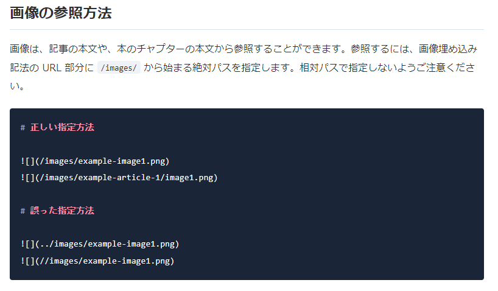

## はじめに
今回の記事は、以下で構築した環境を快適にするための修正内容です。
https://zenn.dev/mknsk0309/articles/20240116-7940d414bbaffc

## 現環境の課題
今回解決する課題は以下の３点です。

- コンテナ開始後、いちいちプレビューを開始するのが面倒くさい。
- 簡単に記事内に画像を貼り付けたい。
- 今後記事が増えてきた時、自動生成されるslugだとわかりづらい。

それでは早速それぞれの課題について改善を行っていきましょう。

## 環境改善
### Update.1 コンテナ起動時にプレビューを開始する
コンテナを起動した後、いちいち手動で`npx zenn preview`をコマンド実行するのが面倒なので、コンテナにリモート接続するたびに自動実行されるように設定します。
```diff json:.devcontainer/devcontainer.json
  /****** 前 略 ******/
  "mounts": [
    "source=${localEnv:HOME}${localEnv:USERPROFILE}/.gitconfig,target=/home/node/.gitconfig,type=bind"
  ],
+ "postStartCommand": "npx zenn preview",
  "customizations": {
    "vscode": {
      "extensions": [
  /****** 後 略 ******/
```

その他、devcontainer.jsonの各プロパティについては以下を参照。
https://containers.dev/implementors/json_reference/

---
### Update.2 画像の貼り付けを簡単にする
ZennをGitHub連携して画像管理もする場合によくでてくるのが、VSCodeの拡張機能 [**Paste Image**](https://marketplace.visualstudio.com/items?itemName=mushan.vscode-paste-image) なんですが・・・。

困ったことにこれが、WSLのリモートコンテナ上だと動かない（Mac環境ならいける？）
詳しい説明は省きますが、色々試してみたり、他の拡張機能も触ってみたのですが、なかなかうまくいかない。

そんな時に見つけたのが[こちら](https://code.visualstudio.com/updates/v1_79#_copy-external-media-files-into-workspace-on-drop-or-paste-for-markdown)。

2023年5月の VSCode(ver 1.79) で拡張機能なしでMarkdownに画像が貼り付けられるようになっていたみたいです。
画像の保存先も変更可能で、ワークスペース内の設定ファイルに以下を追加してみました。
```diff json:.vscode/settings.json
{
  "markdown.copyFiles.destination": {
    "articles/*.md": "/images/articles/${documentBaseName}/",
    "books/*/*.md": "/images/books/${documentDirName}/${documentBaseName}/"
  }
}
```
articlesファイル内で画像貼り付けを行った場合は`/images/articles/{記事ファイル名}/`内に画像が配置されます。

しかし、この機能もなかなか曲者で、注意点が３つほど・・・。
#### 注意① `${documentDirName}`のバグ
設定ファイルではbooks用の設定も行っておりますが、変数`${documentDirName}`にバグがあり、うまく機能しません・・・。

#### 注意② 画像ファイル名の設定ができない
現状、保存される画像ファイル名も変更ができないようで、`image.png`または`image-{連番}.png`でしか出力されません。

#### 注意③ Zenn CLI との相性の悪さ
この機能、使い方は簡単で、記事内でスクリーンショットを挿入箇所で`Ctrl + V`を十個するだけなんですが・・・。
```md

```
挿入されるときのコードが**相対パス**なんです。
[Zenn公式](https://zenn.dev/zenn/articles/deploy-github-images#%E7%94%BB%E5%83%8F%E3%81%AE%E5%8F%82%E7%85%A7%E6%96%B9%E6%B3%95)からもご丁寧に注意されている**誤った指定方法**なんです。


なので貼り付けた後は**手動で絶対パス**にしてあげてください・・・。

---
### Update.3 記事、本の作成を簡単にする
最後のアップデートとして、記事・本の作成を簡単に実装します。
Zenn CLI 標準のコマンドだと、ランダムなスラッグによるファイル名（またはディレクトリ名）の記事（または本）が生成されるじゃないですか。

あのslugだけだとわかりづらいので、生成されるファイルのフォーマットを`yyyymmdd-{ランダムなslug}`にしたいと思います。

Googleが開発しているJavaScriptで記述できる**zx**を使用してみます。

#### zxのインストール
Dockerfileにzxをインストールするよう記述を追加します。
```Dockerfile:.devcontainer/Dockerfile
###### 前 略 ######
RUN apk -no-catche add \
  git \
  bash\
  && yarn global add zenn-cli \
  && yarn global add zx
###### 後 略 ######
```

Dockerfileを修正後、コンテナをリビルドしておきます。

#### npmの初期化
リビルド後、コンテナのターミナルで以下のコマンドを実行。
```bash
npm init
```

コマンドを実行すると`package.json`というファイルが作成されます。
コマンド実行時に入力要求される項目はとりあえずすべてEnterでもいいでしょう。
詳しいプロパティの内容は以下を参照。
https://docs.npmjs.com/cli/v10/configuring-npm/package-json

#### JavaScriptファイルの作成
次に、zxコマンドで動作するスクリプトファイルを作成します。
`scripts`フォルダを作成し、`new-files.mjs`ファイルを作成します。

```js:scripts/new-files.mjs
#!/usr/bin/env zx
$.verbose = false;
const path = require("path");

// 1,2番目はnodeとzxのパスのため、3番目の引数以降を取り出す
const args = process.argv.slice(3);

// 日付取得
const today = (await $`date "+%Y%m%d"`).stdout.trim();

// ファイルの作成
var filePath = "";
switch (args[0]) {
  case "article":
    // articleファイルの作成
    var result = (await $`zenn new:article`).stdout.trim();
    // 作成したファイル名の取得
    filePath = result.match(/articles\/.*\.md/)[0];
    break;

  case "book":
    // bookフォルダとファイルの作成
    var result = (await $`zenn new:book`).stdout.trim();
    // 作成したフォルダ名の取得
    filePath = result.match(/books\/.*(?=\/)/)[0];
    break;

  default:
    // 引数が不正の場合は例外をスロー
    throw "error: invalid arguments.";
}

// 日付付きslugの生成
let { dir, base: fileName } = path.parse(filePath);
let newPath = `${dir}/${today}-${fileName}`;

// ファイルのリネーム
$`mv ${filePath} ${newPath}`;

var green = '\x1B[32m';
var reset = '\x1B[39m';
console.log("created: " + green + newPath + reset);
```

:::message
上記のファイルに引数（`article` / `book`）を渡すことで、`yyyymmdd-{ランダムなslug}`のファイルを作成することができます。
:::

#### package.jsonにコマンドの実装
スクリプトファイルが完成したら、`package.json`ファイルを編集します。

```json:package.json
/***** 前 略 *****/
  "scripts": {
    "new-article": "zx ./scripts/new-files.mjs article",
    "new-book": "zx ./scripts/new-files.mjs book"
  },
/***** 後 略 *****/
```

#### 使い方
以上で、準備が整いました。
後は、コンテナのターミナルから
```bash
npm run new-article
```
と打てば、日付付きの記事ファイルが、
```bash
npm run new-book
```
と打てば、日付付きの本ディレクトリがそれぞれ生成されます。

## まとめ
新しい知識も取り入れて、これでだいぶZennの執筆が楽になったのではないでしょうか。
画像の挿入など、まだまだ改善の余地はありますが、とりあえずはこれで運用してみたいと思います。

実際に私が運用しているリポジトリはこちら。
https://github.com/mknsk0309/zenn-public